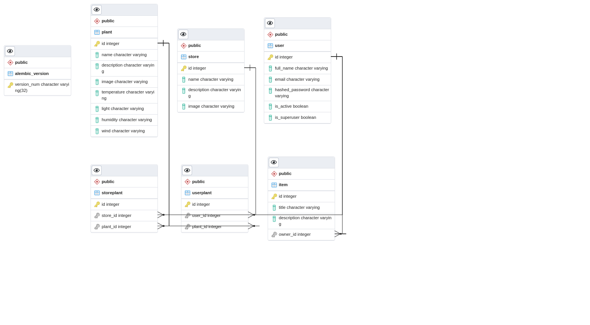

# PlantCare BE
## How to run
- Để chạy backend chỉ cần gõ lệnh

```bash
    docker-compose up
```

## Note
- Lưu ý nếu máy có ứng dụng nào chạy ở port 80 thì nên tắt đi
- Nếu máy chạy Apache service ở port 80 có thể tắt 80
    ```bash
        sudo systemctl stop apache2.service (Linux)
    ```
- API sẽ được chạy ở localhost/api/v1
- Để xem API document mở localhost/redoc hoặc localhost/docs
- Để xem database vô localhost:5050 đăng nhập bằng
    - Username: admin@plantcare.com
    - Password: changethis
    - Postgres server: db
    - Postgres username: postgres
    - Postgres password: changethis
    - Database name: app

- Super user account
    - email: admin@plantcare.com
    - password: changethis

## Hướng dẫn sử dụng VirtualBox
- Khi mở VirtualBox lên chạy 192.168.56.1/redoc để xem doc API
- APi sẽ chạy ở 192.168.56.1/api/v1 (Ví dụ 192.168.56.1/login/access-token để lấy token)
- Link: https://drive.google.com/file/d/16Bmn1lqavX4T5ravAuJfI1TFPwCPc4DE/view?usp=sharing
- Link hướng dẫn sử dụng: https://www.awesomescreenshot.com/video/3757124?key=3389b88544543e26ed9de4c70646a75a
- Có thể SSH vào VMBox bằng lệnh
```bash
    ssh triettran200800@192.168.56.102
```

## Database diagram


## Progress
- [x] Hoàn tất API plant details
- [x] Hoàn tất API search plants
- [x] Hoàn tất API add, remove và list các favorite plant
- [x] Hoàn tất các API basic về user, bao gồm login, signup (create_user)
- [x] Hoàn tất API phân loại plants (trả về top 5 result với input là base64 string)
- [x] Hoàn tất Database diagram